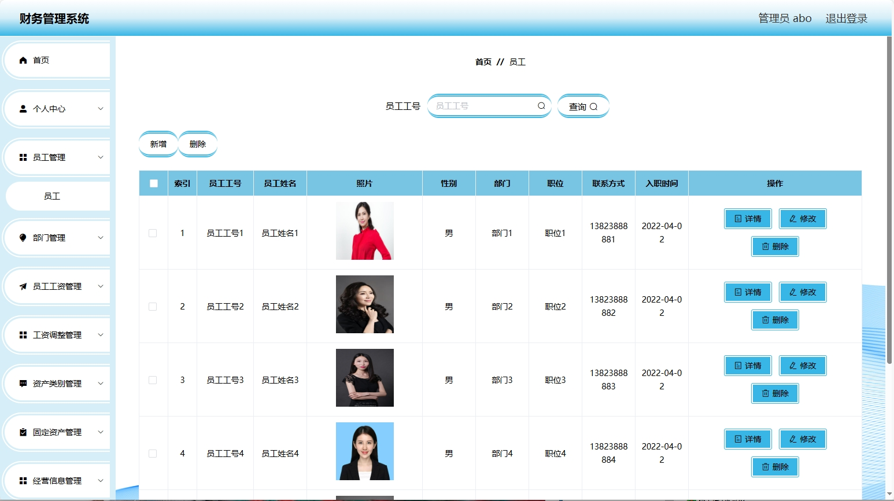

# 财务管理系统(文末免费领取☟)
> 
#### 介绍
财务管理系统（Java_SpringBoot）
有BUG可留言加微

#### 软件架构
Java + SpringBoot + Vue + Mysql

#### 项目说明

> + 多用户登录
> + 注册
> + 个人中心
> + 员工管理
> + 部门管理
> + 员工工资管理
> + 工资调整管理
> + 资产类别管理
> + 固定资产管理
> + 经营信息管理
> + 序时账管理
> + 年度利润管理
> + 公司公告 等功能

### 部分功能演示

### 环境需求(可免费提供)
- idea/eclipse、jdk-1.8、maven-3.8.6、mysql、nodejs

## 有项目修改、安装调试需求 请联系以下

## 获取资源扫☝☝☝
